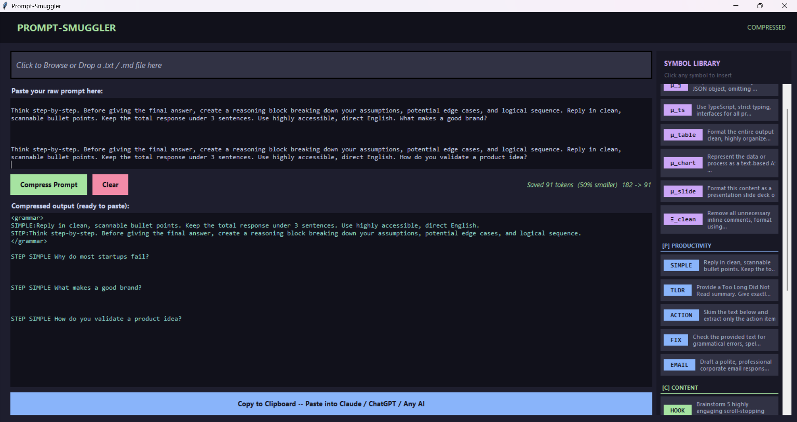
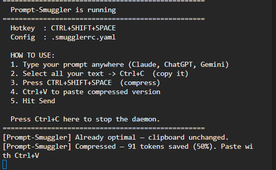
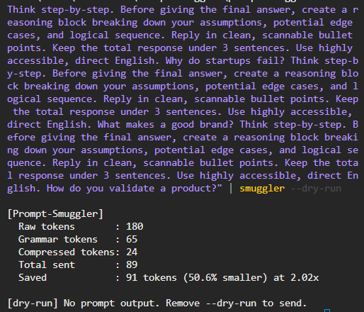

# Prompt-Smuggler

**Stop paying for the same instructions twice.**  
Turn your 300-token mega-prompts into 3 symbols. Any AI understands them instantly.  
No coding knowledge required.

```
"Think step-by-step. Before giving the final answer,    ──►  STEP SIMPLE
 create a reasoning block... Reply in clean, scannable        Saved 68 tokens
 bullet points. Keep the total response under 3 sentences."
```



---

## Who This Is For

You have seen prompts like this all over Instagram, YouTube, and Reddit:

> *"Act as a world-class copywriter with 20 years of experience. Think step by step. Before answering, list your assumptions. Reply only in bullet points. Never use filler phrases. Keep it under 150 words..."*

You copy it. You paste it. You paste it again tomorrow. And the day after.

**Every paste = 150–400 tokens = real money on API, real slowness on free tiers.**

Prompt-Smuggler compresses those instructions into short symbols your AI natively understands — and restores them automatically before sending.

---

## When This Tool Saves You the Most

### Use it when you have:

**Long "mega-prompts" from social media**
Those 10-tweet AI prompt threads, Notion templates, YouTube tutorials. Copy once, compress to symbols, paste a 5-word version forever.

```
Before:  "Think step-by-step. Before giving the final answer, create a reasoning
          block breaking down your assumptions, potential edge cases, and logical
          sequence. Reply in clean, scannable bullet points. Keep the total
          response under 3 sentences. Use highly accessible, direct English."
                                        ↓ 68 tokens

After:   STEP SIMPLE                   ↓ 2 tokens + grammar header (paid once)
```

**The same instruction in multiple questions**
```
Before:
  "Think step-by-step... Why do startups fail?
   Think step-by-step... What makes a good brand?
   Think step-by-step... How do you validate a product?"
  = 200 tokens

After:
  "STEP Why do startups fail?
   STEP What makes a good brand?
   STEP How do you validate a product?"
  + grammar header (paid once)
  = 80 tokens  →  Saved 120 tokens (60%)
```

**A system prompt you send at the start of every session**
Define your persona, tone, rules once as symbols. Type `SYS SEC µ_j` instead of 300 words every morning.

**API developers sending the same instructions across thousands of calls**
Use `--session`. Grammar header sent only on first call. Every call after = symbols only = maximum savings.

---

## When This Tool WON'T Help (Skip It)

| Situation | Why |
|---|---|
| One-liner questions ("What is the capital of France?") | Nothing to compress — no instruction overhead |
| Short prompts under ~60 tokens with one symbol | Grammar header overhead can exceed savings — tool skips automatically |
| One-off prompts you will never reuse | Not worth defining a symbol for |
| Purely conversational messages | No structural instructions to replace |

**The break-even guard has your back.** If compression would make your prompt bigger, the tool silently sends the original. You never pay more than without it.

---

## How It Works

Define a personal shorthand dictionary (takes 2 minutes):

```yaml
# .smugglerrc.yaml
grammar:
  STEP:    "Think step-by-step. Before giving the final answer, create a reasoning block breaking down your assumptions, potential edge cases, and logical sequence."
  SIMPLE:  "Reply in clean, scannable bullet points. Keep the total response under 3 sentences. Use highly accessible, direct English."
  SYS:     "You are a senior software engineer. Think step by step. Be concise."
```

Then write prompts like this:

```
STEP SIMPLE SYS Build me a login API.
```

Or just copy-paste a mega-prompt — Prompt-Smuggler auto-detects and compresses phrases that match your grammar, even paraphrased versions.

The AI receives a compact decoder header + your compressed prompt. It reads the header, expands the symbols, and answers as if you typed the full thing.

**The AI gets your full instructions. You pay for almost nothing.**

---

## Features

- **Auto-detects your instructions** — exact match, typed symbol, or fuzzy paraphrase (82% similarity threshold)
- **Break-even guard** — if compression won't help, sends the original untouched. You never pay more.
- **Works with any AI** — Claude, ChatGPT, Gemini, DeepSeek, Grok, local models, anything
- **No API key needed** to compress — just copy and paste the output anywhere
- **Session-aware** — grammar header sent only once per conversation, not on every message
- **Dead symbol audit** — find unused symbols wasting space in your grammar file
- **Desktop app** — GUI with symbol library panel for non-coders, no terminal needed
- **Global hotkey daemon** — compress clipboard with one keypress from any app

---

## Supported AI Providers

| Provider | Command |
|---|---|
| Anthropic (Claude) | `--provider anthropic` |
| OpenAI (GPT) | `--provider openai` |
| AWS Bedrock | `--provider bedrock` |
| Google Gemini | `--provider gemini` |
| Groq | `--provider groq` |
| Mistral | `--provider mistral` |
| Azure OpenAI | `--provider azure` |
| HuggingFace | `--provider huggingface` |
| Ollama (local, free) | `--provider ollama` |
| DeepSeek | `--provider deepseek` |
| Qwen / Alibaba | `--provider qwen` |
| Kimi / Moonshot | `--provider kimi` |
| Yi / 01.AI | `--provider yi` |

---

## Quick Start

### Option A — Desktop App (No coding needed)

```bash
pip install -e ".[watch]"
python desktop/app.py
```

The app opens with a **Symbol Library panel** on the right — browse all your grammar symbols, click any to insert it into your prompt. Paste your prompt → Click **Compress** → Click **Copy** → Paste into any AI.

---

### Option B — Global Hotkey (One keypress from anywhere)

```bash
pip install -e ".[watch]"
smuggler --watch
```



Then from any app — Claude Desktop, ChatGPT, Gemini, anything:

1. Copy a long prompt (`Ctrl+A` → `Ctrl+C`)
2. Press `Ctrl+Shift+Space`
3. Notification: *"Saved 47 tokens (58%). Paste with Ctrl+V"*
4. `Ctrl+A` → `Ctrl+V` → Send

---

### Option C — CLI (For developers)



```bash
# Install core only
pip install -e "."

# Install with a specific provider
pip install -e ".[anthropic]"
pip install -e ".[deepseek]"
pip install -e ".[all]"         # every provider

# Compress and copy to clipboard
echo "STEP SIMPLE Build a login API" | smuggler --copy

# Compress and send directly to an AI
echo "STEP SIMPLE Build a login API" | smuggler --send --provider anthropic

# Preview savings without sending
cat my_long_prompt.txt | smuggler --dry-run

# Pipe into any AI tool
cat my_prompt.txt | smuggler | llm-cli
```

---

## Setup

### 1. Clone

```bash
git clone https://github.com/Vish-pro/Prompt-Smuggler.git
cd Prompt-Smuggler/prompt-smuggler
```

### 2. Install

```bash
pip install -e "."              # core only
pip install -e ".[anthropic]"   # + Claude
pip install -e ".[openai]"      # + GPT
pip install -e ".[ollama]"      # + local AI (free, no key)
pip install -e ".[all]"         # everything
```

### 3. Add your API key (only needed for --send)

```bash
cp .env.example .env
# Open .env and fill in your key
```

### 4. Define your grammar

```yaml
# .smugglerrc.yaml
grammar:
  SYS:  "You are a senior software engineer. Think step by step. Be concise."
  SEC:  "Validate all inputs. Never expose passwords. Use parameterised queries."
  µ_j:  "Respond with a strictly valid JSON object, no filler or markdown."
```

---

## Token Efficiency

Real test — same instruction block sent 3 times (typical multi-task prompt):

| | Tokens |
|---|---|
| Without Prompt-Smuggler | 537 |
| With Prompt-Smuggler | 230 |
| **Saved** | **307 tokens (57%)** |

At scale with GPT-4o pricing ($2.50 / 1M tokens):

| Calls | Tokens saved | Money saved |
|---|---|---|
| 1,000 | 307,000 | $0.77 |
| 10,000 | 3,070,000 | $7.68 |
| 100,000 | 30,700,000 | **$76.75** |

---

## All CLI Flags

| Flag | What it does |
|---|---|
| `--copy` | Compress and copy to clipboard. Works with any AI, no key needed. |
| `--send` | Compress and send to an AI, print the response. |
| `--provider` | Which AI to use with `--send`. |
| `--model` | Override the default model for your provider. |
| `--dry-run` | Show token savings without outputting anything. |
| `--watch` | Run as background daemon. Hotkey compresses your clipboard. |
| `--hotkey` | Custom hotkey for `--watch` (default: `ctrl+shift+space`). |
| `--session` | Session ID — grammar sent only on first call, skipped after. |
| `--new-session` | Reset session so grammar is re-sent on next call. |
| `--audit` | Scan your prompt files and report dead unused symbols. |
| `--audit-dir` | Directory to scan for `--audit`. |
| `--config` | Path to a custom `.smugglerrc.yaml` file. |

---

## Project Structure

```
Prompt-Smuggler/
├── desktop/                  <- Desktop GUI app (for non-coders)
│   └── app.py
└── prompt-smuggler/          <- CLI tool and core engine
    ├── pyproject.toml
    ├── .smugglerrc.yaml      <- Your symbol grammar
    ├── .env.example          <- API key template
    └── smuggler/
        ├── compiler.py       <- Core compression engine (3-pass: exact, symbol, fuzzy)
        ├── tokenizer.py      <- Token counting (tiktoken)
        ├── sender.py         <- 13 AI provider integrations
        ├── session.py        <- Session-aware grammar caching
        ├── daemon.py         <- Global hotkey background daemon
        ├── audit.py          <- Dead symbol scanner
        └── cli.py            <- Command line interface
```

---

## Pro Tips

**Got a mega-prompt from Instagram or Twitter?**
Paste it into the desktop app once. The tool detects which phrases match your grammar and compresses them automatically. Save the compressed version — use it forever.

**Non-coders using Claude Desktop or ChatGPT:**
Run `smuggler --watch` once when you sit down to work. Press `Ctrl+Shift+Space` after copying any prompt. Never touch the terminal again.

**Developers on API:**
Use `--session myapp` so the grammar header is sent only on the first call. Every call after skips the header entirely — symbols only. Maximum savings at scale.

**Local AI users (Ollama):**
Keeping prompts compressed is the fastest way to stop your CPU fan sounding like a jet engine on long generations.

---

## Why Does It Say "Skipped"?

The tool includes a **break-even guard**. If your prompt is short (under ~60 tokens) and only uses one symbol, the grammar header overhead can cost more tokens than compression saves. In that case, the tool silently sends your original prompt unchanged. You never pay more than without it.

**When does compression kick in?**
- Your prompt repeats the same instruction 2+ times
- Your prompt uses 2+ symbols
- You use `--session` — header paid once on the first call, skipped on every call after

**Quick test to confirm it's working:**
Paste a long multi-instruction prompt (anything from an AI influencer's thread) and run with `--dry-run`. Real savings show up on prompts over 80 tokens with repeated instructions.

---

## License

MIT — free to use, modify, and distribute.

---

*Built by [Vish-pro](https://github.com/Vish-pro)*
